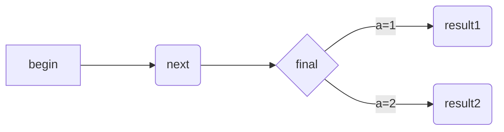

# 一级标题

### 三级标题

*倾斜*

_倾斜_

**加粗**

__加粗__

***倾斜加粗***

*__倾斜加粗__*

~~删除线~~

==高亮==

\\转译

\*转译

***

---

___
## 无序表

* 表一

  * 表三

* 表二

## 有序表

1. 列表一

5. 列表5

   1. tab子列表

   2. [point](#anchor)

# 任务表

- [x] 已完成

- [ ] 未完成

## 区块引用

> 引用

取消引用须空白行

### 嵌套引用

> >

## 代码框

`反单引号内代码框`

`仅限一行`

### 多行代码


```python

三个以上反单引号

表现为代码框

```


```python

mess='添加语言类型'

printf(mess)

```

## 图片插入


## 文本链接

#### 行内

[description](http://guzhenglin.com)

### 直接调用网址

<http://guzhenglin.com>

## 公式

$tex$

## 流程图



## 脚注


example [^1]

[^1]:just a joke

## 缩略

> waiting

## 跳转

<span id='anchor'>point</span>